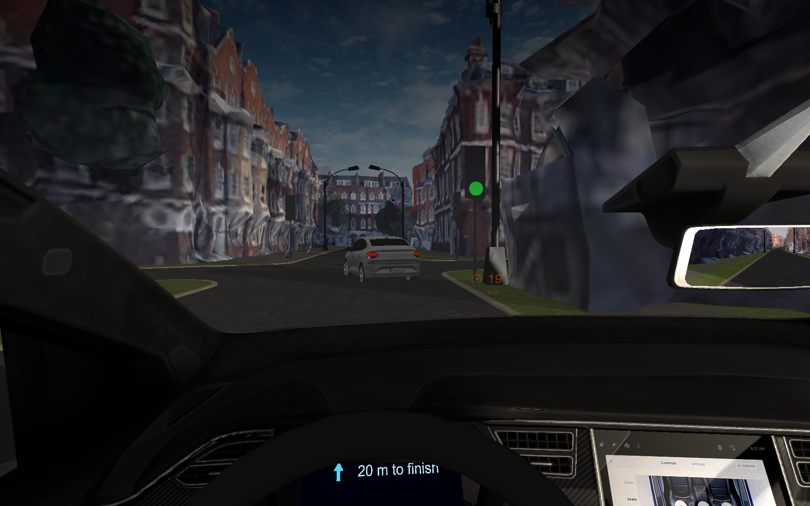
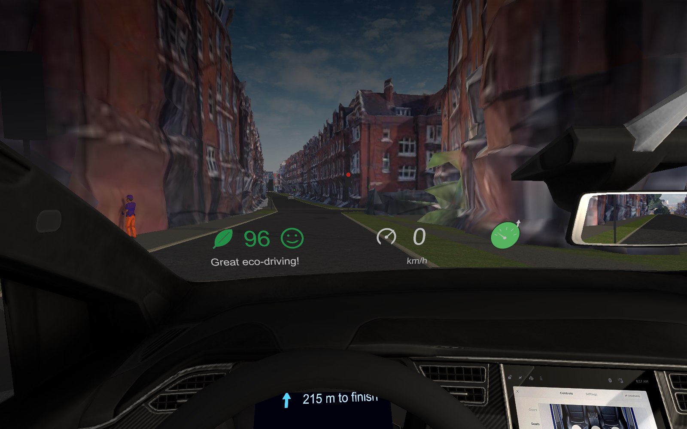
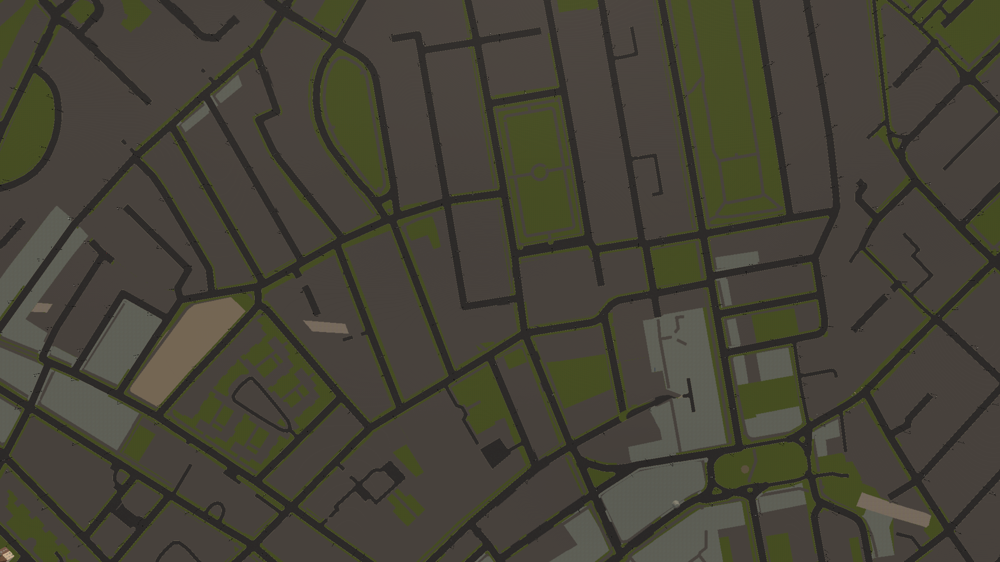
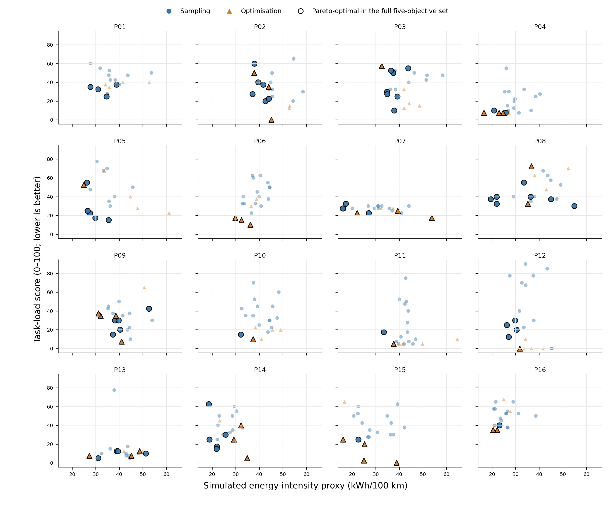

# Sustainable Personalised Driving

**Applying Human-in-the-Loop Multi-Objective Bayesian Optimisation to Eco-Driving Interface Design**

Code, releasable study data, and analysis for an MSc dissertation study (UCL, COMP0191). Sixteen participants each drove 21 short rounds through a virtual reproduction of Knightsbridge/Chelsea in VR while a multi-objective Bayesian optimiser searched a seven-dimensional eco-driving HUD design space against five objectives, per participant and within a single session.

  

## Contents · 目录

- [English](#overview)
  - [Overview](#overview)
  - [Study at a glance](#study-at-a-glance)
  - [Repository layout](#repository-layout)
  - [Data release and privacy](#data-release-and-privacy)
  - [Third-party assets (not distributed)](#third-party-assets-not-distributed)
  - [Reproducing the analysis](#reproducing-the-analysis)
  - [License](#license)
  - [Thesis](#thesis)
- [中文](#概述)
  - [概述](#概述)
  - [研究概况](#研究概况)
  - [仓库结构](#仓库结构)
  - [数据发布与隐私](#数据发布与隐私)
  - [未随仓库分发的第三方资产](#未随仓库分发的第三方资产)
  - [复现分析](#复现分析)
  - [许可证](#许可证)
  - [论文](#论文)

---

## Overview

Eco-driving displays are usually evaluated as a few fixed designs shown identically to every driver. This project instead treats the display as a per-participant search problem: a human-in-the-loop multi-objective Bayesian optimiser (qEHVI, BoTorch) proposes HUD configurations round by round, driven by each participant's own driving data and ratings.

| | |
|---|---|
| Simulator | Unity 6000.3.9f1, Meta Quest 3S (Link), Logitech G25, Yaw motion platform |
| Environment | Google Photorealistic 3D Tiles (visual) + CityGen3D road mesh from OpenStreetMap (driveable), Knightsbridge / Belgravia / Chelsea |
| Design space | 7 continuous parameters: six element sizes + overall opacity (elements can vanish below a size threshold) |
| Objectives | simulated energy-intensity proxy (road-load model), task load, informativeness, pleasantness, legibility |
| Protocol | 15 Sobol sampling rounds → 5 qEHVI rounds → 1 repeat of the recommended configuration |

  
  

## Study at a glance

16 participants, 336 driving rounds, 4 fixed urban routes (160–280 m). Cumulative hypervolume rose for 15/16 participants; the recommended configurations improved all four subjective objectives against a same-route sampling baseline, left the simulated energy proxy unchanged, and differed markedly between participants.

  

## Repository layout

| Path | Content |
|---|---|
| `Unity/Runtime/` | Simulator scripts: vehicle control (steering wheel + pedals), ambient-traffic behaviours, round controller, in-VR questionnaire, logging |
| `Unity/Runtime/EcoHUD/` | The parameterised eco-driving HUD, eco-score / road-load energy model, optimiser bridge, motion-platform link |
| `Unity/Editor/` | Scene/study setup tools and the Cesium × CityGen3D alignment & road-corridor cutting tools |
| `Unity/BOforUnity/` | Files added to or modified in the BO-for-Unity toolkit (`FinalDesignSelector.cs`, `BoForUnityManager.cs`) |
| `Unity/Shaders/` | Dual-overlay road-cutout shader for blending the photogrammetry tiles with the road mesh |
| `Tools/` | Route generation and centreline-snapping utilities (Python) |
| `Data/` | Releasable pseudonymous study data — see [`Data/README.md`](Data/README.md) |
| `Analysis/` | R analysis scripts and their figure/table outputs |
| `Thesis/` | The dissertation PDF |

`Unity/README.md` documents installation and usage of the editor tools.

## Data release and privacy

Released per participant (P01–P16): per-round design parameters and driving/questionnaire summaries, optimiser observation and hypervolume logs, study configuration, route geometry, and a per-file hash manifest of the simulator scripts at session time. `Data/master_rounds.csv` is the single entry table for the analysis.

Withheld pending a re-identification-risk review, as stated in the thesis: raw post-session questionnaire exports (demographic combinations and free text), continuous high-frequency trajectories, and detailed console logs. Verbatim per-session script snapshots stay in the private archive; the published hashes allow verification.

## Third-party assets (not distributed)

The Unity project depends on assets and services that cannot be redistributed here: Cesium for Unity (1.23.3) with Google Photorealistic 3D Tiles (requires your own API key), CityGen3D, Gley Traffic System (3.6.2), Meta XR / OpenXR runtime, QuestionnaireToolkit, and commercial vehicle models. The [BO-for-Unity](https://github.com/Pascal-Jansen/Bayesian-Optimization-for-Unity) toolkit and its BoTorch backend are available upstream; only the files this study added or modified are included here.

## Reproducing the analysis

R 4.6.1. `Analysis/analysis.R` reads the data layout described in `Data/README.md` and regenerates the statistics, figures, and tables reported in the thesis (outputs included under `Analysis/output/`). Package versions are listed in the thesis appendix.

## License

Code is released under the [MIT License](LICENSE). Files under `Unity/BOforUnity/` derive from the MIT-licensed [BO-for-Unity](https://github.com/Pascal-Jansen/Bayesian-Optimization-for-Unity) toolkit and retain its notice. The study data (`Data/`) and analysis figures (`Analysis/output/`) are available under [CC BY 4.0](https://creativecommons.org/licenses/by/4.0/). The dissertation (`Thesis/`) is (c) the author, all rights reserved.

## Thesis

`Thesis/` contains the dissertation: *Sustainable Personalised Driving: Applying Human-in-the-Loop Multi-Objective Bayesian Optimisation to Eco-Driving Interface Design* (MSc Artificial Intelligence for Sustainable Development, UCL). The study was approved by the UCL Research Ethics Committee (project 1165).

---

## 概述

生态驾驶显示通常以少数固定设计、对所有驾驶者一视同仁地进行评估。本项目把显示设计当作按参与者独立的搜索问题：人在环多目标贝叶斯优化器（qEHVI，BoTorch）根据每位参与者自己的驾驶数据与评分，逐轮提出 HUD 配置。

| | |
|---|---|
| 模拟器 | Unity 6000.3.9f1、Meta Quest 3S（Link）、罗技 G25、Yaw 动感平台 |
| 环境 | Google 照片级 3D 瓦片（视觉）+ CityGen3D 由 OpenStreetMap 生成的道路网格（可驾驶），Knightsbridge / Belgravia / Chelsea |
| 设计空间 | 7 个连续参数：六类元素尺寸 + 整体不透明度（尺寸低于阈值的元素消失） |
| 优化目标 | 模拟能耗强度代理值（道路载荷模型）、任务负荷、信息量、愉悦度、可读性 |
| 流程 | 15 轮 Sobol 采样 → 5 轮 qEHVI 优化 → 1 轮推荐配置复测 |

## 研究概况

16 名参与者、336 个驾驶轮次、4 条固定城市路线（160–280 米）。15/16 名参与者的累积超体积上升；推荐配置相对同路线采样基线改善了全部四项主观目标，模拟能耗代理值无显著变化，且参与者之间的最终配置差异显著。

## 仓库结构

| 路径 | 内容 |
|---|---|
| `Unity/Runtime/` | 模拟器脚本：车辆控制（方向盘+踏板）、环境交通行为、轮次控制、VR 内问卷、日志 |
| `Unity/Runtime/EcoHUD/` | 参数化生态驾驶 HUD、生态分/道路载荷能耗模型、优化器桥接、动感平台链路 |
| `Unity/Editor/` | 场景与研究配置工具、Cesium × CityGen3D 对齐与道路走廊裁剪工具 |
| `Unity/BOforUnity/` | 对 BO-for-Unity 工具包新增/修改的文件 |
| `Unity/Shaders/` | 摄影测量瓦片与道路网格融合的双叠加裁剪着色器 |
| `Tools/` | 路线生成与中心线吸附工具（Python） |
| `Data/` | 可发布的匿名化研究数据，详见 [`Data/README.md`](Data/README.md) |
| `Analysis/` | R 分析脚本及图表输出 |
| `Thesis/` | 学位论文 PDF |

## 数据发布与隐私

按参与者（P01–P16）发布：每轮设计参数与驾驶/问卷汇总、优化器观测与超体积日志、研究配置、路线几何，以及会话时刻模拟器脚本的逐文件哈希清单。`Data/master_rounds.csv` 是分析的统一入口表。

按论文所述，以下内容在再识别风险评估完成前暂不发布：会后问卷原始导出（人口学组合与自由文本）、连续高频轨迹、详细控制台日志。逐字脚本快照保存在私有归档中，已发布的哈希可供核验。

## 未随仓库分发的第三方资产

Unity 工程依赖无法在此再分发的资产与服务：Cesium for Unity（1.23.3）与 Google 照片级 3D 瓦片（需自备 API key）、CityGen3D、Gley Traffic System（3.6.2）、Meta XR / OpenXR 运行时、QuestionnaireToolkit 及商业车辆模型。[BO-for-Unity](https://github.com/Pascal-Jansen/Bayesian-Optimization-for-Unity) 工具包及其 BoTorch 后端请从上游获取，此处仅包含本研究新增或修改的文件。

## 复现分析

R 4.6.1。`Analysis/analysis.R` 读取 `Data/README.md` 描述的数据布局，重新生成论文所报告的统计量、图和表（输出已附于 `Analysis/output/`）。软件包版本见论文附录。

## 许可证

代码以 [MIT 许可证](LICENSE)发布；`Unity/BOforUnity/` 下的文件衍生自 MIT 许可的 [BO-for-Unity](https://github.com/Pascal-Jansen/Bayesian-Optimization-for-Unity) 工具包并保留其声明。研究数据（`Data/`）与分析图表（`Analysis/output/`）以 [CC BY 4.0](https://creativecommons.org/licenses/by/4.0/) 提供。学位论文（`Thesis/`）版权归作者所有，不在上述许可范围内。

## 论文

`Thesis/` 为学位论文：*Sustainable Personalised Driving: Applying Human-in-the-Loop Multi-Objective Bayesian Optimisation to Eco-Driving Interface Design*（UCL，MSc Artificial Intelligence for Sustainable Development）。研究经 UCL 研究伦理委员会批准（项目号 1165）。
