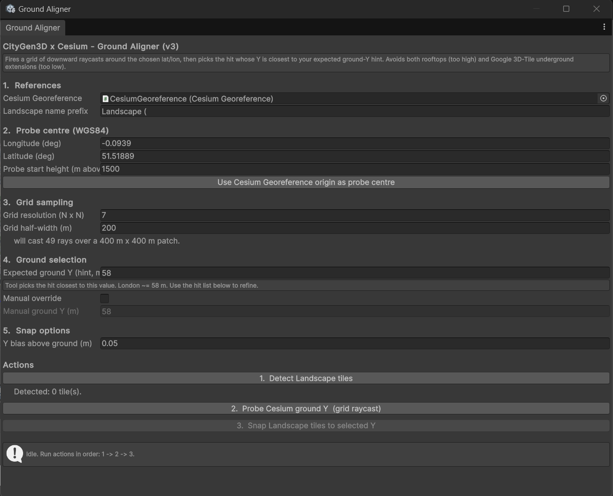
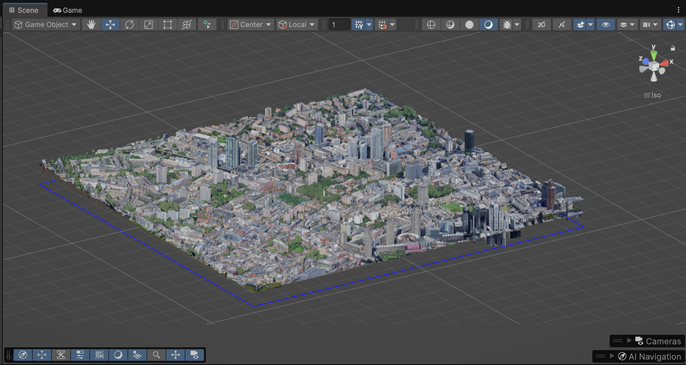

# CesiumCityGenAligner

Unity Editor tool for vertically aligning CityGen3D Landscape tiles with Cesium 3D Tiles.

This tool was developed for the Sustainable Personalized Driving project to support the integration of CityGen3D road networks with Cesium-rendered Google Photorealistic 3D Tiles.

---

## Purpose

CityGen3D and Cesium use different height references.

CityGen3D places its Landscape tiles directly in Unity world-space Y, while Cesium renders georeferenced 3D Tiles based on real-world coordinates. Therefore, using the same numerical height value does not guarantee that the CityGen3D road network and the Cesium city model will appear at the same vertical level.

This tool provides a reusable workflow for aligning the CityGen3D road network with the visible Cesium ground level.

---

## What the Script Does

The script adds a Unity Editor window:

```text
Tools > CityGen3D x Cesium > Ground Aligner
```

The tool:

1. Detects CityGen3D Landscape tiles by name prefix.
2. Places a Cesium Globe Anchor probe at the selected latitude and longitude.
3. Casts a grid of downward raycasts around the probe point.
4. Collects hit heights from the Cesium 3D Tiles.
5. Selects the hit closest to the expected ground-height hint.
6. Snaps the CityGen3D Landscape tiles to the selected height.

---

## Repository Contents

```text
CesiumCityGenAligner/
├── CesiumCityGenAligner.cs
├── README.md
└── images/
    ├── aligner_window.png
    └── after_alignment.png
```

---

## Installation

Place the script in the following Unity project path:

```text
Assets/Editor/CesiumCityGenAligner.cs
```

The script must be placed inside an `Editor` folder because it uses Unity Editor APIs.

---

## Usage

Open the tool from the Unity menu:

```text
Tools > CityGen3D x Cesium > Ground Aligner
```

Then run the steps in order:

```text
1. Detect Landscape tiles
2. Probe Cesium ground Y
3. Snap Landscape tiles to selected Y
```

---

## Main Parameters

### Cesium Georeference

Reference to the active Cesium Georeference object in the scene.

### Probe Centre

The latitude and longitude used as the centre point for ground-height probing.

### Grid Resolution

Controls how many raycasts are fired around the probe centre.

For example:

```text
7 x 7 = 49 raycasts
```

### Grid Half-Width

Controls the physical size of the probing area in metres.

### Expected Ground Y Hint

The approximate expected street-level height in Unity world-space Y.

The tool selects the raycast hit closest to this hint.

### Manual Override

Allows the user to manually enter the target ground Y value if needed.

### Y Bias

Adds a small vertical offset above the selected ground height to reduce z-fighting.

---

## Example

### Ground Aligner Tool



### Aligned Result



---

## Requirements

- Unity
- Cesium for Unity
- CityGen3D
- Google Photorealistic 3D Tiles loaded through Cesium
- Physics meshes enabled on the Cesium 3D Tileset

---

## Notes

The target Cesium tiles must be loaded before probing. If the tiles have not streamed into the scene yet, the raycast may return no hit.

The expected ground-height hint may need adjustment when moving to another city or region.

This repository only provides the alignment script. It does not include CityGen3D, Cesium, Google Photorealistic 3D Tiles data, or any paid assets.

---

## Project Context

This tool is part of the COMP0190 P87 project:

Sustainable Personalized Driving: Three-Layer HITL Bayesian Optimization for Eco-Driving Behaviour, Interface Design & Route Recommendation

The alignment tool supports the Unity driving simulation environment used for later eco-driving interface design and Human-in-the-Loop Bayesian Optimization experiments.
